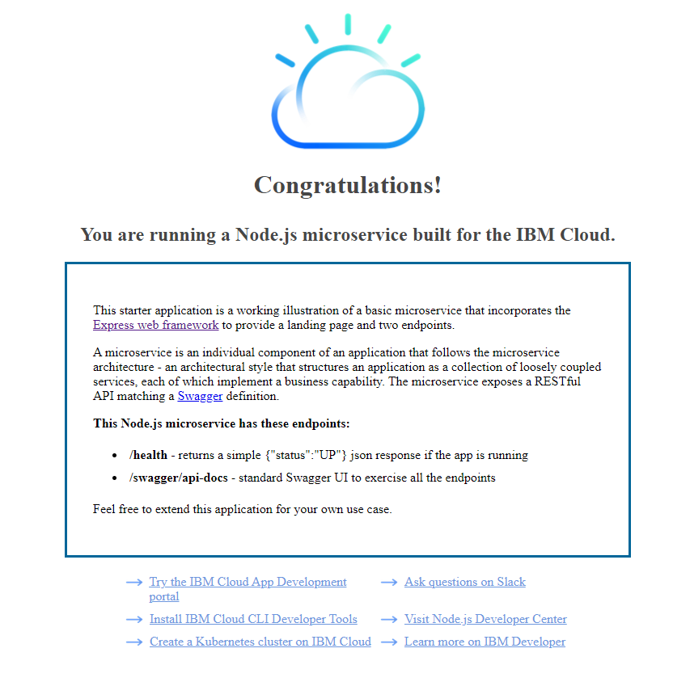

# First step

- Get the client, server, and worker folders ready from a previous repo

# Setting Up the IbmCloud & having it autoGen a application

1. first make sure you are signed up on IBM with an account
2. follow this link to make sure you have the ibm cli [click here](https://cloud.ibm.com/docs/cli?topic=cli-getting-started#step1-install-idt)
3. once installed login inside yout terminal with `ibmcloud login`
4. Then make sure you target a resource group, whcih is usually `Default` or `default`(case-sensitive)
   - `imbcloud target -g Default`
     or
   - `ibmcloud target -g default`
5. you can use a kubernetes starter kit running the command `ibmcloud dev create` into a directory of your choice just follow the prompts
   - Select Backend Service / Web App > Node> Node.js Express App.
   - Enter a unique name for your application such as <your-initials>kubeapp.
   - Select the resource group where your cluster has been created. This might happen automatically.
   - Do not add additional services.
   - Do not add a DevOps toolchain, select manual deployment.
   - Choose "Deploy to Helm-based Kubernetes containers"
6. after operations are complete, manually merge the deployment and cloud enablement files that are saved to the app directory
   follow the next couple of steps or SKIP TO STEP**\*\*\*\***\*\***\*\*\*\***\*\***\*\*\*\***\*\***\*\*\*\***
7. check if the app has been stored in the directory with `ls`
8. Change into the directory
9. run the command `ibmcloud dev build`
10. then run the command `ibmcloud dev run`
11. Check to see that is running by going to `localhost:3000` you should see something like this
    

## Adding a serivice and modyfying the code

1. run `ibmcloud dev edit` command in the cli
2. follow the prompts to create and connect a new data-related service to you app, such as IBM Cloudant
3. you can manually merge the configuration files that are saved to you appdirectory when you creat the service. Or you can skip this step for now.
4. Update your code
5. save any files that you modified

- Enabling command parameters

  - config file `imbcloud dev enable --config-file <configFileName>`
    - specify a `cli-config.yaml` file to use for a command
  - force `ibmcloud dev enable -f|--force`
    - parameter that is used to force a reenabling an already enabled app
  - language `ibmcloud dev enable -l|--language <language>`
    - parameter that is used to specify the langugage of the app to be enabled
  - trace `ibmcloud dev enable --trace`
    - use this parameter to provide vebose output
  - get-credintials `ibmcloud dev get-credentails --trace`
    - use this parameter to provide verbose output

- ## List all IBM Cloud apps in a resource group
  - run the following comand `ibmcloud dev lists`

---

# Build the application with IBMCloud

1. Ensure your local Docker engine is started

- `docker ps`

2. Define an environment variable name set with the name of the application you generated in the previous section:

- `export <variableName>=<AppYouGeneratedInPreviousStep>`

3. change to the directory of the generated project
